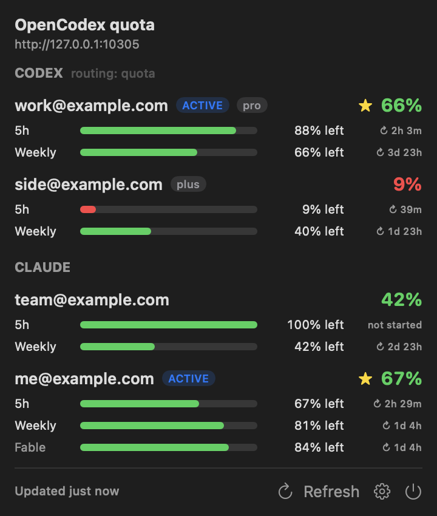

# OCXBar — OpenCodex quota in the macOS menu bar

A tiny SwiftUI menu bar app that shows the remaining quota (5h / weekly / model-scoped) of every account in your local [OpenCodex](https://www.npmjs.com/package/@bitkyc08/opencodex) pool — Codex and Claude side by side. Unofficial; not affiliated with OpenAI, Anthropic, or OpenCodex.

**Windows:** [Usage Tray](Windows/UsageTray/README.md)는 Codex와 Claude Code의 남은 사용량을 작업표시줄에 표시하는 별도 앱입니다. OpenCodex 서버 없이 이 PC의 Codex CLI 및 Claude Code 로그인 계정을 사용합니다. Windows용 빌드와 사용 방법은 링크된 문서를 참고하세요.



## 설치 (Apple Silicon, macOS 13+)

1. [Releases](https://github.com/thswldns77/ocxbar/releases/latest)에서 `OCXBar-x.y.z.zip`을 받아 풀고, `OCXBar.app`을 “응용 프로그램” 폴더로 옮깁니다.
2. Apple 공증을 받지 않은 앱이라 처음 한 번은 아래 둘 중 하나로 엽니다.
   - 터미널: `xattr -dr com.apple.quarantine /Applications/OCXBar.app` 후 더블클릭
   - 또는 더블클릭 → 막히면 *시스템 설정 → 개인정보 보호 및 보안 → 그래도 열기*
3. 같은 Mac에서 OpenCodex(`ocx`)가 실행 중이면 메뉴바에 `CX 66% · CL 67%` 같은 표시가 나타납니다. 관리자 토큰은 `~/.opencodex/admin-api-token`에서 자동으로 읽습니다.

## 기능

로컬 OpenCodex 서버에 등록된 계정들(OpenAI/Codex 풀 + Claude 등 OAuth 제공자)의 사용량(quota)을 60초마다 읽어서 메뉴바에 표시하는 가벼운 SwiftUI 앱입니다.

- 메뉴바: 제공자별로 사용 가능한 계정 중 **가장 여유가 큰 계정의 남은 사용량** — 예: `CX 1% · CL 94%` (CX = Codex, CL = Claude). 제공자가 하나뿐이거나 설정에서 하나를 고르면 `OCX 94%`. 서로 다른 한도라서 제공자끼리 섞지 않습니다.
- 클릭: 제공자별 섹션 안에 계정별 5h / Weekly / 30d(+ Claude의 모델별 창, 예: Fable) 남은 양(또는 사용량), 리셋까지 남은 시간, ACTIVE·plan·paused·reauth 표시, Codex 라우팅 전략(예: `quota`)
- 계정이 있는 제공자는 자동으로 찾습니다. 나중에 Kimi·Grok 등 계정을 OpenCodex에 추가해도 따로 설정할 필요가 없습니다.
- 60초 자동 갱신 + **Refresh** 버튼(OpenCodex에 업스트림 재조회 요청)
- 설정(톱니바퀴): 서버 URL, 관리자 토큰(선택), 메뉴바에 표시할 제공자(전체/하나), 목록 표시 방식(남은 양/사용량), 로그인 시 자동 실행
- 서버가 꺼져 있거나 인증이 실패하면 메뉴바가 `OCX --`로 바뀌고 창에 오류 이유를 보여줍니다. 앱은 계속 돌면서 다음 주기에 다시 시도합니다.

요구 사항: macOS 13 이상, Swift 5.9 이상 툴체인(Xcode 없이 Command Line Tools만 있어도 됨).

## 소스에서 빌드 & 실행

```bash
cd OCXBar

# 1) 앱 번들 만들기 → build/OCXBar.app
scripts/make-app.sh

# 2) 바로 실행
open build/OCXBar.app

# 또는: ~/Applications 에 설치하고 실행까지 한 번에 (권장 — 로그인 자동 실행은 설치된 위치를 기억함)
scripts/make-app.sh --install
```

개발 중에는 번들 없이도 돌릴 수 있습니다(이 경우 로그인 자동 실행 토글은 비활성화됨).

```bash
swift build
swift run OCXBar
```

### 터미널에서 확인(문제 해결용)

```bash
.build/debug/OCXBar --dump              # 메뉴가 보여줄 내용을 텍스트로 출력
.build/debug/OCXBar --dump --refresh    # 업스트림 재조회 후 출력
.build/debug/OCXBar --dump --url http://localhost:10100
```

## 로그인 시 자동 실행

**방법 A (권장, 앱 안에서):** `scripts/make-app.sh --install` 로 ~/Applications 에 설치 → 메뉴바 `OCX` 클릭 → 톱니바퀴 → **Launch at login** 켜기.
macOS의 SMAppService를 쓰므로 *시스템 설정 → 일반 → 로그인 항목*에 OCXBar가 나타나고, 거기서 끌 수도 있습니다. 앱 위치를 옮기면 토글을 한 번 껐다 켜 주세요.

**방법 B (시스템 설정):** *시스템 설정 → 일반 → 로그인 항목 → “로그인 시 열기”의 +* 에서 `~/Applications/OCXBar.app` 추가.

**방법 C (LaunchAgent):** `~/Library/LaunchAgents/local.opencodex.ocxbar.plist` 생성:

```xml
<?xml version="1.0" encoding="UTF-8"?>
<!DOCTYPE plist PUBLIC "-//Apple//DTD PLIST 1.0//EN" "http://www.apple.com/DTDs/PropertyList-1.0.dtd">
<plist version="1.0">
<dict>
    <key>Label</key><string>local.opencodex.ocxbar</string>
    <key>ProgramArguments</key>
    <array><string>/usr/bin/open</string><string>-a</string><string>OCXBar</string></array>
    <key>RunAtLoad</key><true/>
</dict>
</plist>
```

```bash
launchctl load ~/Library/LaunchAgents/local.opencodex.ocxbar.plist     # 등록
launchctl unload ~/Library/LaunchAgents/local.opencodex.ocxbar.plist   # 해제
```

## OpenCodex 연동 방식 (opencodex 2.64.0에서 실제 응답으로 확인)

| 용도 | 요청 |
|---|---|
| 계정 + 쿼터 | `GET /api/codex-auth/accounts` (Refresh 버튼은 `?refresh=1`) |
| 활성 계정·라우팅 | `GET /api/codex-auth/active` → `activeCodexAccountId`, `accountPoolStrategy`, `pinned` |
| 쿼터 보충(계정에 quota가 없을 때) | `GET /api/codex-auth/quota` |
| 대체 경로(위가 404일 때) | `GET /api/oauth/accounts?provider=openai&quota=1` |
| 기타 제공자 찾기 | `GET /api/oauth/providers` → 제공자마다 `GET /api/oauth/accounts?provider=<id>`(로컬 조회, 계정 없으면 건너뜀) |
| 기타 제공자 쿼터(Claude 등) | `GET /api/oauth/accounts?provider=<id>&quota=1` (서버 TTL 캐시, Refresh 버튼은 `&refresh=1`) |

- **인증:** OpenCodex 관리 API는 관리자 토큰이 필요합니다. 앱은 `X-OpenCodex-API-Key` 헤더로 보내며, 토큰은 다음 순서로 찾습니다: 설정의 토큰 → 환경변수 `OPENCODEX_ADMIN_AUTH_TOKEN` → `$OPENCODEX_HOME/admin-api-token` → `~/.opencodex/admin-api-token` (OpenCodex 서버가 시작할 때 만드는 파일). 보통은 아무것도 설정할 필요가 없습니다.
- **퍼센트 의미:** OpenCodex 값은 *사용한 비율*입니다(`weeklyPercent: 99` = 1% 남음 — Codex 앱의 “Usage remaining 1%”와 같음). 5h 창은 `fiveHourPercent` 또는 `shortPercent`+`shortWindowSeconds: 18000`, 30d는 `monthlyPercent`.
- **계정의 “남은 양”** = 그 계정의 창들 중 가장 많이 쓴 창 기준(5h가 99%면 주간이 넉넉해도 1%). 단, Claude의 모델별 창(`customWindows`, 예: Fable)은 목록에만 보이고 계산에서는 빠집니다 — 그 모델이 막혀도 다른 모델은 쓸 수 있기 때문입니다.
- **메뉴바 숫자** = 제공자마다 paused/reauth가 아닌 계정 중 남은 양이 가장 큰 값(쓸 수 있는 계정이 없으면 전체 중 최대). 설정의 “Used” 표시는 목록에만 적용되고 메뉴바는 항상 남은 양입니다.
- 서버에 연결이 안 되거나 토큰이 틀리면 `OCX --`. 특정 제공자의 쿼터 조회만 실패하면 나머지는 그대로 보이고 그 섹션에 경고가 표시됩니다.
- 5시간 창이 끝난 뒤 아직 다시 쓰지 않은 계정은 Claude가 5h 값을 아예 보내지 않거나 0%·리셋 시간 없음으로 보냅니다. 이때는 `5h 100% left · not started`로 표시합니다(다음 요청 때 새 창이 시작됨).
- 파서는 camelCase/snake_case, 초·밀리초·ISO 시각, 문자열 숫자, `*RemainingPercent` 필드, 업스트림형 `primary/secondary { used_percent, window_minutes }`, `windows/customWindows` 배열까지 받아들이도록 되어 있어 OpenCodex 버전이 바뀌어도 최대한 버팁니다.

## 팀원에게 배포

```bash
scripts/package.sh
# → dist/OCXBar-1.0.0.zip         앱 + 설치방법.txt (팀원에게 이 파일을 전달)
# → dist/OCXBar-1.0.0-source.zip  빌드 가능한 소스
```

- Apple Silicon 전용입니다. 버전은 `Resources/Info.plist`의 `CFBundleShortVersionString`을 올리면 파일 이름에 반영됩니다.
- Apple 개발자 인증서로 서명·공증하지 않은 앱이라, 팀원은 처음 한 번 `xattr -dr com.apple.quarantine /Applications/OCXBar.app` 또는 *시스템 설정 → 개인정보 보호 및 보안 → 그래도 열기*로 열어야 합니다(`docs/INSTALL.txt`에 안내 포함).
- 팀원 각자의 Mac에서 OpenCodex가 실행 중이어야 하고, 각자의 `~/.opencodex/admin-api-token`을 읽으므로 비밀 값은 앱에 들어 있지 않습니다.

## 구조

```
Package.swift                 SwiftPM 실행 타깃 (macOS 13+)
LICENSE                       MIT
docs/                         INSTALL.txt(배포 zip 설치 안내), screenshot.png
Resources/Info.plist          LSUIElement(Dock 아이콘 없음), 로컬 네트워크 허용
scripts/make-app.sh           release 빌드 → .app 번들 → ad-hoc 서명 [--install]
Sources/OCXBar/
  main.swift                  MenuBarExtra 앱 진입점 + --dump 모드
  QuotaStore.swift            60초 폴링, 상태, 설정(UserDefaults)
  OCXClient.swift             HTTP, 토큰 탐색, 엔드포인트 폴백
  QuotaParser.swift           관대한 JSON 파싱
  Models.swift                계정/창 모델, 포맷터
  Views.swift                 메뉴 창 UI, 설정 패널
  LoginItem.swift             로그인 시 자동 실행(SMAppService)
```

설정은 `defaults read local.opencodex.ocxbar` 로 볼 수 있고, `defaults delete local.opencodex.ocxbar` 로 초기화됩니다.
